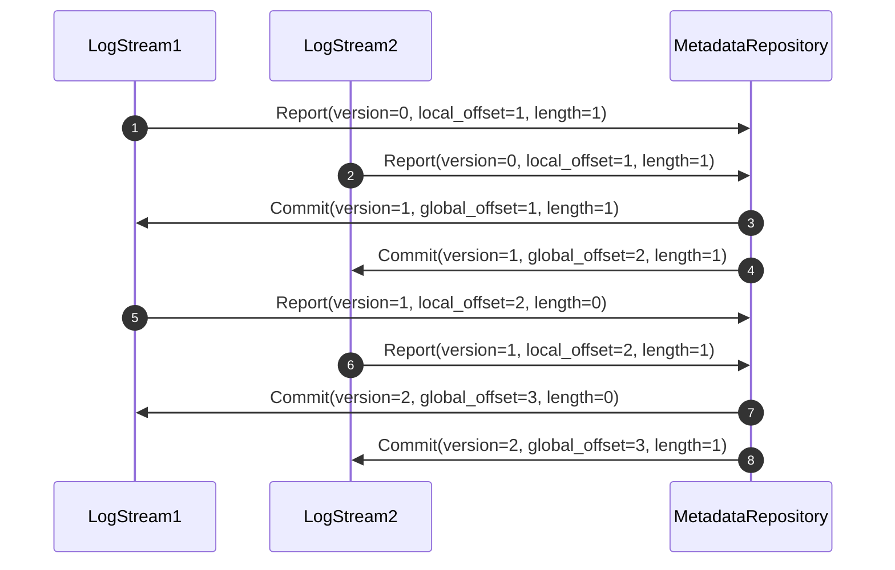
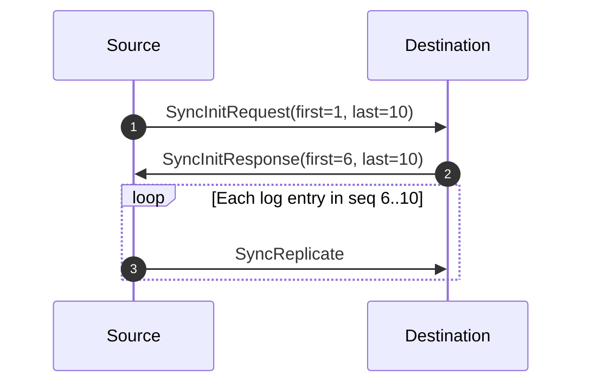
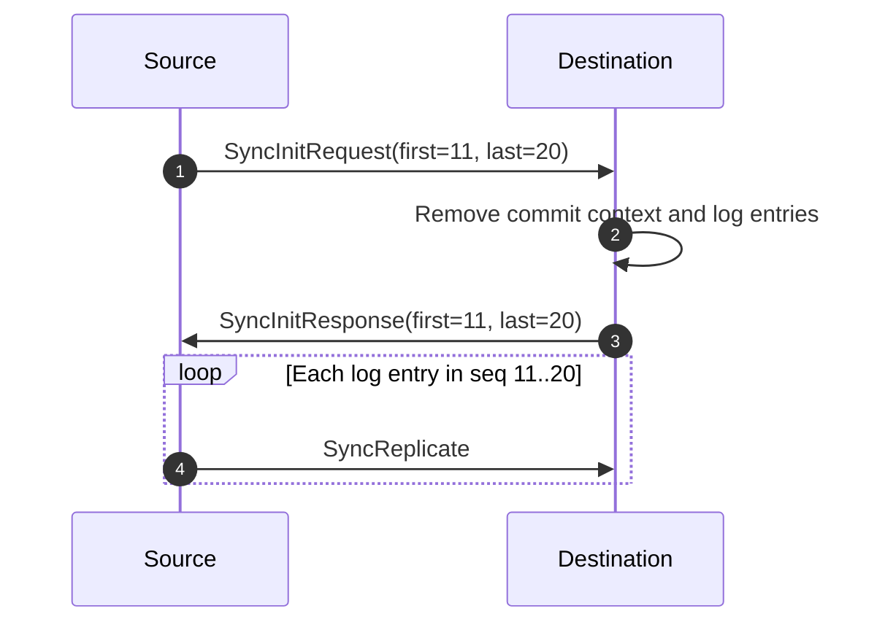

- Feature: Commit context
- Status: completed
- Authors: @ijsong
- Varlog Issue: #125
- RFC PR: #149

# Summary

A large amount of empty commit contexts slows down log stream recovery and
consumes a significant amount of disk space. To solve these problems, this RFC
proposes to store only the latest commit context rather than a sequence of
commit contexts. From the log entries already stored in the local, the log
stream can restore the local low and high watermark and the position where a
log entry will save. It can also recover the highest version confirmed by the
metadata repository from the latest commit context.

# Background

The log stream executor stores a series of commit contexts to help the cluster
recover. It creates a commit context for each commit message sent from the
metadata repository even if it does not contain logs, which we call "empty
commit context."

Previously, saving a series of commit contexts was useful while recovering a
cluster. It helped a log stream report its status during bootstrapping or
synchronizing and was also used for recovering a metadata repository that did
not use WAL.

However, a considerable number of empty commit contexts causes some problems:

- They take up lots of disk space, although they have no information about log
entries.
- Restarting a log stream takes a long time since it full-scans commit contexts
to look up a non-empty commit context.

Keeping the least of commit contexts is necessary to save disk space and
decrease bootstrap duration.

## Report

A log stream sends a report to the metadata repository; the report contains the
followings:

- The highest version the log stream replica knows
- The local offset of log entries written but not committed
- The length of log entries written but not committed

The report tells the metadata repository how many log entries the log stream
wants to commit. The metadata repository knows which offset and version the
report must be for the log stream to store log entries sequentially. The log
stream must not report the same offsets across different reports after
committing any log entries. For example, if the log stream sent a report which
has a log entry starting at offset 1 in version 1 and committed the log entry,
the log stream must not report which has log entries starting at offset 1 in
version 2.

## Commit and its context

The metadata repository sends a commit message to the log stream. The commit
message contains the followings:

- New version issued by the metadata repository
- The local and global offset of log entries committed
- The length of log entries committed

The metadata repository announces how many logs the log stream can commit
through the commit message. It tracks a unique tuple of `(version,
local_offset, global_offset, length)` for each log stream. Once all
replicas in a log stream accept the commit message, the metadata repository can
trim the tuple already applied to the replicas in the log stream. How does the
metadata repository know if all replicas in a log stream apply the commit
message? As we see in the previous chapter, it decides by receiving all reports
with the same version from the replicas.

Commit context is the environment in which the metadata repository generates a
commit. A log stream stores a commit context with committed log entries and
restores the commit context during recovery. It makes the log stream send the
metadata repository an accurate report after recovery.

```
// https://github.com/kakao/varlog/blob/1340bba15a9ad52f9eb581e282617825da8a32d1/internal/storage/commit_context.go#L5-L11
type CommitContext struct {
	Version            types.Version
	HighWatermark      types.GLSN
	CommittedGLSNBegin types.GLSN
	CommittedGLSNEnd   types.GLSN
	CommittedLLSNBegin types.LLSN
}
```

For tidiness, this proposal uses `version`, `local_offset`, `global_offset`,
and `length` rather than `Version`, `CommittedLLSNBegin`,
`CommittedGLSNBegin`, and `CommittedGLSNEnd-CommittedGLSNBegin`.

## Empty commit context

Empty commit context means a commit message has a higher version, but its
length field is zero; it has no log entries committed.



Assume that there are two log streams in a cluster. Each has a written log
entry; thus, they send the metadata repository reports (i.e., 1 and 2)
indicating them. As a result of reports, the metadata repository replies to
them with commit messages (i.e., 3 and 4) containing their log sequence number.
After receiving the commit message, each log stream commits the written log
with a commit context. For example, LogStream1 will store the following commit
context:

```go
// LogStream1
commit_context{
        version:       1,
        global_offset: 1,
        local_offset:  1,
        length:        1,
}
```

Next, LogStream1 has no written log entry. It, thus, sends reports whose length is
zero (i.e., 5). The metadata repository generates the next version of a commit
that issues a log sequence number only for LogStream2. LogStream1 receives a
commit message (i.e., 7) with no committed log. After receiving this commit,
LogStream1 will store an empty commit:

```go
// LogStream1
commit_context{
        version:       2,
        global_offset: 3,
        local_offset:  2,
        length:        0,
}
```

As mentioned above, the commit context helped the log stream and metadata
repository to recover. It will not be explained here because of out of scope.

# Design

## Invariant of the commit context

A log stream stores commit context and committed log entries atomically. The
commit context specifies the range of log entries; hence, `local_offset +
length` in the commit context must be equal to the position of the following
log entry. That is, `local_offset + length` in the commit context should equal
the current local high watermark. We can guarantee that position of all
committed log entries is less than `local_offset + length` in the commit
context.

## Recovery of log stream replica

We need only the latest commit context to recover a log stream replica.

1. Seek the first log entry, which is the `local_low_watermark.`
2. Seek the last log entry, which is the `local_high_watermark.`
3. Read the commit context.
4. If the `local_offset + length` in the commit context is equal to the `local
   high watermark + 1`, recovery of the log stream replica completes;
   otherwise, it either needs synchronization or fails.

Suppose the `local_offset + length` in the commit context is less than the
`local_high_watermark + 1`. In that case, the replica cannot usually work since
it breaks the above invariant. If the recovery fails, the replica can remove
the erroneous data, including the commit context, and the log stream will
synchronize after that.

On the other hand, if the `local_offset + length` in the commit context is
greater than the `local_high_watermark + 1`, it also fails. It means that some
suffix log entries do not exist. Because the log stream deletes its prefix
entries, suffix entries should remain rather than prefix entries.

## Synchronization

Replicas in a log stream should have duplicate log entries. If a replica has
less than the others, it should receive missing log entries from the other; it
is called synchronization.



Before copying the log entries, two replicas have to negotiate a range of log
entries to copy; the RPC SyncInit does that. In the above sequence diagram, the
destination replica already has log entries from 1 to 5; thus, it replies
SyncInit with a range of missing log entries from 6 to 10. Then, it receives
log entries through the RPC SyncReplicate.

When a destination replica receives a range of log entries from the source
replica, the range might not be sequential with the ones already had.
Concretely, the starting log sequence number of the range sent from the source
can be greater than the following sequence number of the replica's last log
entry. It means that the Trim operation removed the prefix logs. The
destination should wipe out all logs and commit context in this case.



The RPC SyncReplicate has only a single payload, either a commit context or a
log entry. It has some problems too:

- Copying log entries one by one is not efficient.
- It transfers a commit context separated from log entries.

The first relates to performance, and well-known approaches such as batch or
stream can improve that. The second can cause a subtle issue described on
[Recovery of log stream replica](#recovery-of-log-stream-replica). Network failure might prevent the
synchronization from transferring either a commit context or log entries.; it
messes up the invariant of the commit context. This problem happens unless
synchronization simultaneously clones all log entries and a commit context.
Thus, we need to remove data as few as possible when the invariant fails.

## Report of replica

Previously, a log stream replica sent a report to the metadata repository
regardless of its status. However, this proposal does not while a replica
synchronizes with another replica. Because the source replica will have only
the latest commit context, it will not send old ones. The destination replica
cannot send accurate reports without knowing the old commit contexts. So, the
metadata repository should allow silent replicas for a while.

Note that the replica can be silent during startup since it can also be invalid
while recovering.

## How to store a commit context

Previously, a sequence of commit contexts is stored separately from log
entries, which is okay. However, we can integrate a commit context with log
entries. The only essential and tiniest information should be stored to avoid
space overhead by duplicating the commit context in each log entry. For
instance, the version and commit offset in the committed log entries. Even the
byte encoding can decrease their size.
