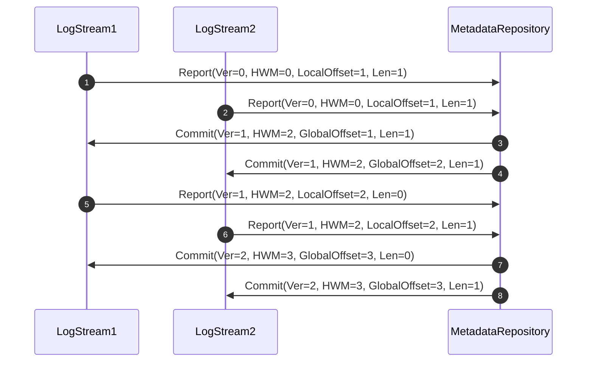

- Feature: Commit context
- Status: draft
- Authors: @ijsong
- Varlog Issue: #125
- RFC PR:

# Summary

A large amount of empty commit contexts not only causes too slow recovery of
log streams but also takes a quite large disk space. To solve these problems,
this RFC proposes to store only the latest non-empty commit context rather
than a sequence of commit contexts. To implement this approach, a log
stream should not send a report to the metadata repository according to its
status.

# Background

The log stream executor stores a series of commit contexts to help the cluster
recover. It creates a commit context for each commit message sent from the
metadata repository even if the commit message does not contain logs, which we
call "empty commit context".

Previously, saving a series of commit contexts was useful while recovering a
cluster. It helped a log stream report its status during bootstrapping or
synchronizing and was also used for recovering a metadata repository that did
not use WAL.

However, a huge number of empty commit contexts causes some problems:
- They take up lots of disk space although they have no information about log
entries.
- Restarting a log stream takes a long time since it full-scans commit contexts
to look up a non-empty commit context.

It, now, is necessary to keep the least of commit contexts to save disk space
and decrease bootstrap duration.

## Commit context

Commit context is context when the metadata repository generates a commit. Each
log stream has a unique tuple of `(Version, HighWatermark, CommittedGLSNBegin)`
for each commit. When a log stream replica sends a report to the metadata
repository, it contains logs written but not committed and previous commit
context, that is, the above tuple. The metadata repository can ensure whether
the report is valid by using the tuple. If, for example, the report from a log
stream replica has a tuple of `(Version, HighWatermark, CommittedGLSNBegin)`
that has not been generated by the metadata repository, the metadata repository
can handle it as a wrong report.

```go
// https://github.com/kakao/varlog/blob/1340bba15a9ad52f9eb581e282617825da8a32d1/internal/storage/commit_context.go#L5-L11
type CommitContext struct {
	Version            types.Version
	HighWatermark      types.GLSN
	CommittedGLSNBegin types.GLSN
	CommittedGLSNEnd   types.GLSN
	CommittedLLSNBegin types.LLSN
}
```

## Report and commit



Assume that there are two log streams in a cluster. Each has a written log
entry, thus they send the metadata repository reports (i.e., 1 and 2)
indicating them. As a result of reports, the metadata repository replies to
them with commit messages (i.e., 3 and 4) containing their log sequence number.
After receiving the commit message, each log stream commits the written log
with a commit context. For example, LogStream1 will store the following commit
context:

```go
// LogStream1
CommitContext{
        Version:            1,
        HighWatermark:      2,
        CommittedGLSNBegin: 1,
        CommittedGLSNEnd:   2,
        CommittedLLSNBegin: 1,
}
```

Next, LogStream1 has no written log entry. It, thus, sends reports whose Len is
zero (i.e., 5). The metadata repository generates the next version of commit
that issues a log sequence number only for LogStream2. LogStream1 receives a
commit message (i.e., 7) that has no committed log for itself. After receiving
this commit, LogStream1 will store an empty commit:

```go
// LogStream1
CommitContext{
        Version:            2,
        HighWatermark:      3,
        CommittedGLSNBegin: 3,
        CommittedGLSNEnd:   3,
        CommittedLLSNBegin: 2,
}
```

As mentioned above, the commit context helped the log stream and metadata
repository to recover. It won't be explained here because of out of scope.

# Design

## Recovery of log stream replica

For recovering a log stream replica, we need only the latest non-empty commit
context. It contains the commit context when the last log entry was committed
in the replica.

1. Seek the first log entry, which is the local low watermark.
2. Seek the last log entry, which is the local high watermark.
3. Read a commit context and check whether the last committed log entry is
   equal to the local high watermark. If they are the same, recovery of the
   replica is done, otherwise, it fails.

If the recovery fails, the replica can just remove the wrong data including the
commit context. The log stream will synchronize after that.

## Silence of replica

Previously, a log stream replica sent a report to the metadata repository
regardless of its status.

In this proposal, however, it does not while a replica is synchronized from
another replica. Because the source replica will have only the latest commit
context, it won't send old commit contexts. The destination replica cannot send
valid reports without knowing the old commit contexts. So, the metadata
repository should allow silent replicas for a while.

Note that the replica can be silent during startup since it can be also invalid
while recovering itself.


## Synchronization

When a log stream replica receives the range of log entries from the source
replica in synchronization, the range might not be sequential. Concretely, the
starting log sequence number of the range sent from the source replica can be
greater than the next sequence number of the replica's last log entry. It means
that the prefix logs were removed by Trim operation. In this case, the source
replica should wipe out all logs and commit context.

Order of synchronization:

1. Destination replica receives SyncInit which specifies the range of log
   entries from the source replica.
2. If the sequence number of the starting log entry in the range is less than
   or equal to the sequence number of the next to last log entry in the
   destination replica, synchronization is simple. Otherwise, go to the next
   step.
3. The destination replica has to remove all logs and commit context before
   copying the new logs from the source replica. Otherwise, it can have a hole
   in the space of log entries.

## How to store commit context

Previously, a sequence of commit contexts is stored separately from log
entries. It is okay. However, we can integrate commit context with log entries.
To avoid space overhead by duplicating the commit context in each log entry,
the only essential and least information should be stored, for instance, the
version and commit offset in the committed log entries. Even their size also
can be decreased by using the Varints encoding.

