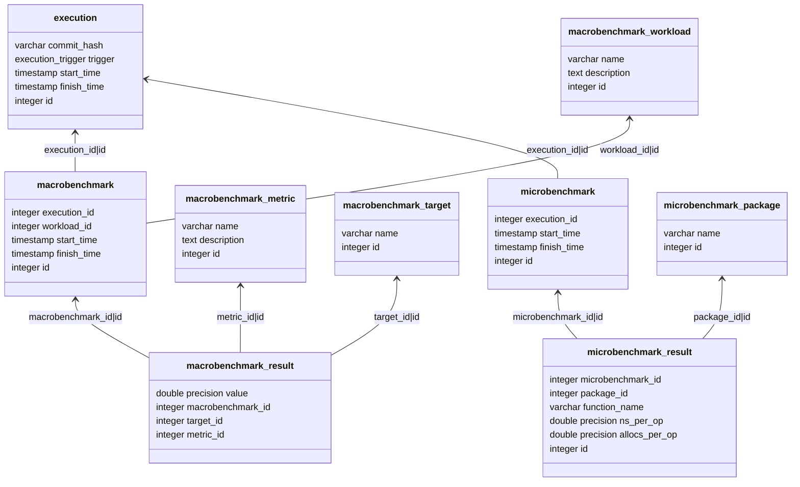

# Benchmark Dashboard: Are We Fast Yet?

```mermaid
classDiagram
direction BT
class execution {
   varchar commit_hash
   execution_trigger trigger
   timestamp start_time
   timestamp finish_time
   integer id
}
class macrobenchmark {
   integer execution_id
   integer workload_id
   timestamp start_time
   timestamp finish_time
   integer id
}
class macrobenchmark_metric {
   varchar name
   text description
   integer id
}
class macrobenchmark_result {
   double precision value
   integer macrobenchmark_id
   integer target_id
   integer metric_id
}
class macrobenchmark_target {
   varchar name
   integer id
}
class macrobenchmark_workload {
   varchar name
   text description
   integer id
}
class microbenchmark {
   integer execution_id
   timestamp start_time
   timestamp finish_time
   integer id
}
class microbenchmark_package {
   varchar name
   integer id
}
class microbenchmark_result {
   integer microbenchmark_id
   integer package_id
   varchar function_name
   double precision ns_per_op
   double precision allocs_per_op
   integer id
}

macrobenchmark  -->  execution : execution_id|id
macrobenchmark  -->  macrobenchmark_workload : workload_id|id
macrobenchmark_result  -->  macrobenchmark : macrobenchmark_id|id
macrobenchmark_result  -->  macrobenchmark_metric : metric_id|id
macrobenchmark_result  -->  macrobenchmark_target : target_id|id
microbenchmark  -->  execution : execution_id|id
microbenchmark_result  -->  microbenchmark : microbenchmark_id|id
microbenchmark_result  -->  microbenchmark_package : package_id|id
```
